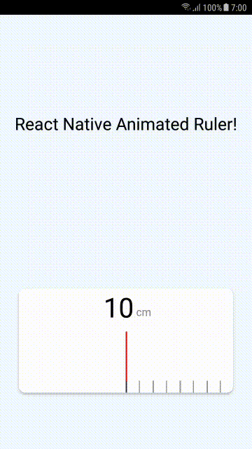

# react-native-animated-ruler

<div align="center">

[](https://github.com/MohamadKh75/react-native-animated-ruler/pulls) &nbsp; [](https://github.com/prettier/prettier) &nbsp; [](https://www.npmjs.com/package/react-native-animated-ruler) &nbsp; [](https://github.com/MohamadKh75/react-native-animated-ruler/blob/master/LICENSE)

</div>

---

## Preview



## Install

| Package Manager |                  Command                   |
| :-------------: | :----------------------------------------: |
|    **yarn**     |   `yarn add react-native-animated-ruler`   |
|     **npm**     | `npm i --save react-native-animated-ruler` |

## Usage

```jsx
import Ruler from 'react-native-animated-ruler';

<Ruler
  style={{ borderRadius: 10, elevation: 3 }}
  width={350}
  height={170}
  vertical={false}
  onChangeValue={value => alert(value)}
  minimum={10}
  maximum={80}
  segmentWidth={2}
  segmentSpacing={20}
  indicatorColor='#FF0000'
  indicatorWidth={100}
  indicatorHeight={80}
  indicatorBottom={20}
  step={10}
  stepColor='#333333'
  stepHeight={40}
  normalColor='#999999'
  normalHeight={20}
  backgroundColor='#FFFFFF'
  numberFontFamily='System'
  numberSize={40}
  numberColor='#000000'
  unit='cm'
  unitBottom={20}
  unitFontFamily='System'
  unitColor='#888888'
  unitSize={16}
/>;
```

## Properties

|       Prop       |         Default          |    Type     |
| :--------------: | :----------------------: | :---------: |
|      style       |            {}            | `ViewStyle` |
|     vertical     |          false           |  `boolean`  |
|      width       |      screen's width      |  `number`   |
|      height      | screen's height \* 0.23  |  `number`   |
|  onChangeValue   |         () => {}         | `function`  |
|     minimum      |            0             |  `number`   |
|     maximum      |           100            |  `number`   |
|   segmentWidth   |            2             |  `number`   |
|  segmentSpacing  |            20            |  `number`   |
|  indicatorColor  |        '#FF0000'         |  `string`   |
|  indicatorWidth  |           100            |  `number`   |
| indicatorHeight  |            80            |  `number`   |
| indicatorBottom  |            20            |  `number`   |
|       step       |            10            |  `number`   |
|    stepColor     |        '#333333'         |  `string`   |
|    stepHeight    |            40            |  `number`   |
|   normalColor    |        '#999999'         |  `string`   |
|   normalHeight   |            20            |  `number`   |
| backgroundColor  |        '#FFFFFF'         |  `string`   |
| numberFontFamily |         'System'         |  `string`   |
|    numberSize    |            40            |  `number`   |
|   numberColor    |        '#000000'         |  `string`   |
|       unit       |           'cm'           |  `string`   |
|    unitBottom    | screen's height \* 0.027 |  `number`   |
|  unitFontFamily  |         'System'         |  `string`   |
|    unitColor     |        '#888888'         |  `string`   |
|     unitSize     |            16            |  `number`   |

## Example

Take a look at [example](./example):

```bash
git clone https://github.com/MohamadKh75/react-native-animated-ruler.git

cd example

yarn

react-native run-android

# OR

react-native run-ios
```

## Credit

This library is based on [awesome Youtube video](https://www.youtube.com/watch?v=vFtDPVnzFLM) by [Catalin Miron](https://twitter.com/mironcatalin)

## License

MIT
